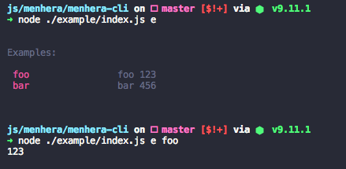

# Menehra-CLI

a cli plugin for menhera

## Use for CLI Tools

```bash
$ yarn global add menhera-cli
```

#### Install Template

```bash
$ mhr e init:cli
```

```bash
$ mhr e init:module
```

## Use For Module

```bash
$ yarn add menhera menhera-cli
```

#### example

```js
// index.js
const mhr = require("menhera").default;
const CLI = require("menhera-cli");

const Foo = CLI({ name: "Foo", version: "0.0.1" });

mhr.$use({
  _mount: {
    Foo
  },
  Foo: {
    commands: {
      _: {
        options: {
          test: { alias: "t", desc: "test", default: null }
        },
        exec({ _, _key, env }) {
          if (env.NONE_INPUTS) {
            _.$use({ Foo: { help: _key } });
          }
        }
      },
      foo: {
        desc: "Test foo",
        args: ["foo", "foo1"],
        examples: {
          foo: "foo 123"
        },
        exec({ foo }) {
          console.log(foo);
        }
      },
      bar: {
        desc: "Test bar",
        args: ["bar"],
        examples: {
          bar: "bar 456"
        },
        exec({ bar }) {
          console.log(bar);
        }
      }
    },
    config: {
      start: true
    }
  }
});


```

```bash
$ node index.js
```



