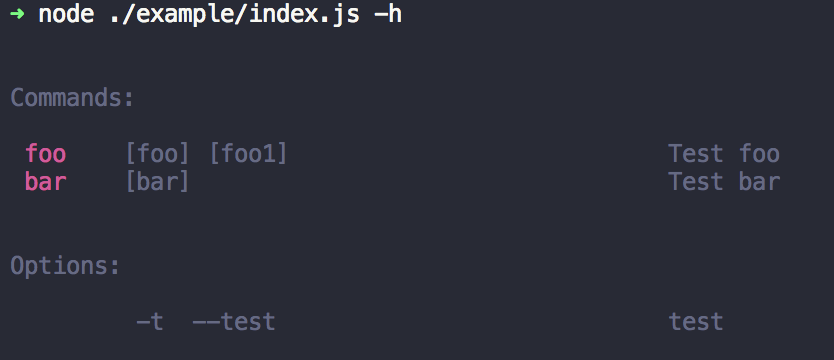

# Menehra-CLI

a cli plugin for menhera

### Use For Cli

```bash
yarn global add menhera-cli

mhr init <my-project>
```

### Use For Module

```bash
yarn add menhera menhera-cli
```

```js
// index.js

const Menhera = require("menhera").default;
const CLI = require("../packages/core").default;

const _ = new Menhera({
  _mount: {
    cli: [CLI]
  },
  CLI: {
    commands: {
      _: {
        desc: "root",
        exec({ _, h }) {
          _.$use({
            CLI: {
              call: {
                help: true
              }
            }
          });
        }
      },
      serve: {
        desc: "Test run server on port",
        args: ["port"],
        exec({ port }) {
          console.log(`server running on port:${port}`);
        }
      }
    }
  }
}).$use({
  CLI: {
    config: {
      version: "0.0.1",
      start: true
    }
  }
});
```

```bash
node index.js
```


