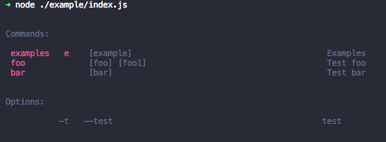

# Menehra-CLI

a cli plugin for menhera

### Use For Module

```bash
yarn add menhera menhera-cli
```

```js
// index.js
const Menhera = require("menhera").default;
const CLI = require("menhera-cli").default;

const _ = new Menhera({
  _mount: {
    CLI
  },
  CLI: {
    commands: {
      foo: {
        desc: "Test foo",
        args: ["foo", "foo1"],
        execs: {
          _({ foo }) {}
        }
      },
      bar: {
        desc: "Test bar",
        args: ["bar"],
        execs: {
          _({ bar }) {}
        }
      }
    }
  }
}).$use({
  CLI: {
    config: {
      name: "example",
      version: "0.0.2",
      start: true
    }
  }
});
```

```bash
node index.js -h
```



```js
// options.js
const Menhera = require("menhera").default;
const CLI = require("menhera-cli").default;

const _ = new Menhera({
  _mount: {
    CLI
  },
  CLI: {
    commands: {
      foo: {
        desc: "Test foo",
        options: {
          foo: {
            alias: "f",
            desc: "foo option"
          },
          bar: {
            alias: "b",
            desc: "bar option"
          }
        },
        execs: {
          "f,!b"({ foo }) {
            console.log(`just option foo: ${foo} `);
          },
          "!f,b"({ bar }) {
            console.log(`just option bar: ${bar} `);
          },
          "f,b"({ foo, bar }) {
            console.log(`both foo: ${foo} and bar: ${bar}`);
          }
        }
      }
    }
  }
}).$use({
  CLI: {
    config: {
      name: "example",
      version: "0.0.2",
      start: true
    }
  }
});
```

```bash
node options.js foo -h
```


